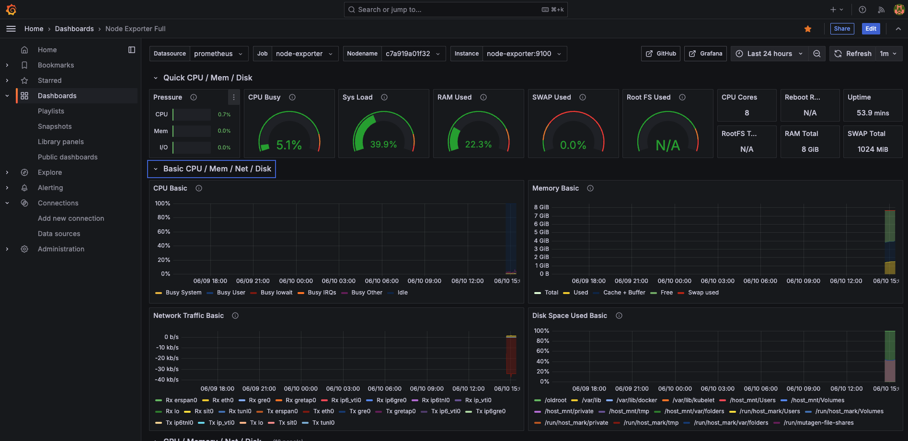
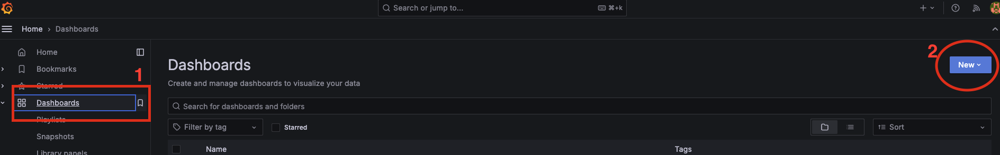
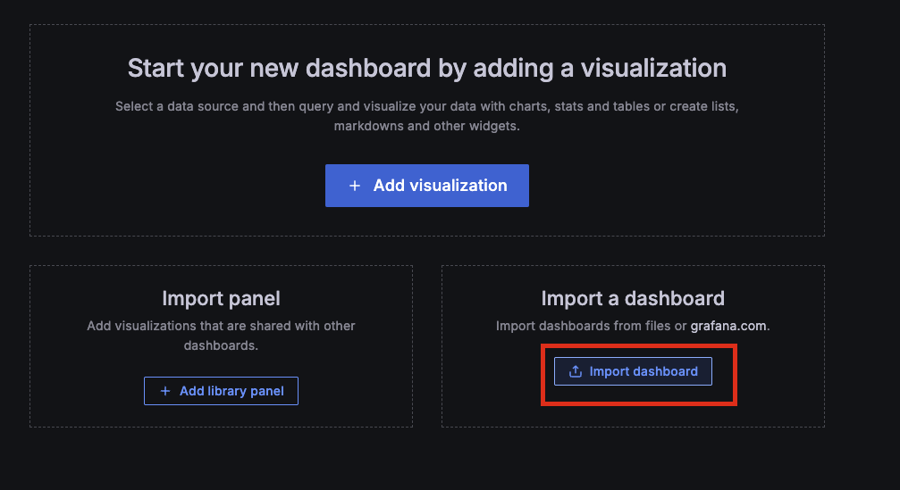
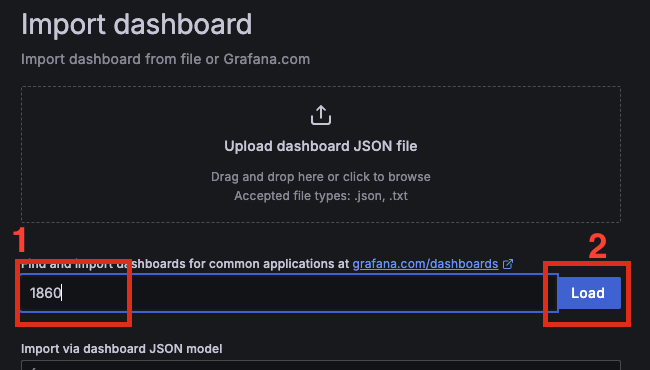
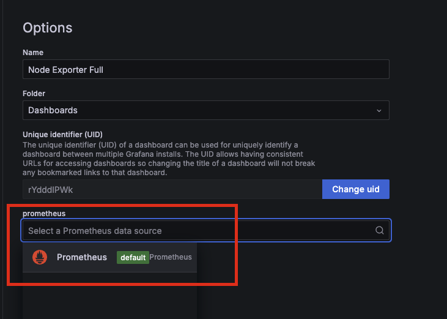
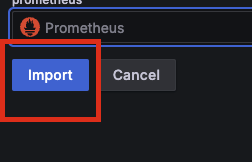
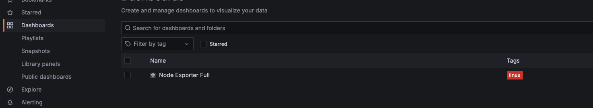

# Grafana Basic - 1 (Grafana + Prometheus + Node-Exporter)

<br>

---

<br>

## Basic Intro

This article will show you how to setup (Grafana + Prometheus + Node-Exporter) for monitoring server runtime info. 

<br>



<br>

### Monitoring Structure

```
[System/APP] → [Node Exporter] → [Prometheus] → [Grafana] → [Engineer User]
```

<br>
<br>
<br>

## Introducing All components

<br>

### 1. Node Exporter - collect system info

* Collect system info (CPU usage, memory usage etc.)
* Provider system info metrics by HTTP query.

<br>

Node Exporter collect:

* CUP usage
* Memory/Disk usage
* Network IO usage

How does it work?

```
# Node Exporter expose data at :9100/metrics
curl http://localhost:9100/metrics

# you may see the output：
# node_cpu_seconds_total{cpu="0",mode="idle"} 12345.67
# node_memory_MemTotal_bytes 8589934592
# node_filesystem_size_bytes{device="/dev/sda1"} 10737418240
```

<br>
<br>

### 2. Prometheus - Metrics Data Source

* Collect metrics data from any kind of source (like Node Exporter).
* Storing metrics as time series data.
* Provide PromQL for querying metrics data.

<br>

work-flow: 

1. Scraping: get mertics data from Node Exporter.
2. Storage: collect metrics data by time serices.
3. rovide querying function.

<br>

setting:

```yml
# prometheus.yml
scrape_configs:
  - job_name: 'node-exporter'
    static_configs:
      - targets: ['node-exporter:9100']
    scrape_interval: 15s  # do scraping every 15 sec
```

<br>

promQL Query Example:

```
# ex-1 CPU usage:
100 - (avg by (instance) (rate(node_cpu_seconds_total{mode="idle"}[5m])) * 100)


# ex-2 Mem usage:
(node_memory_MemTotal_bytes - node_memory_MemAvailable_bytes) / node_memory_MemTotal_bytes * 100
```

<br>
<br>

### 3. Grafana - Visualize The Metrics Data (Chart Panel)

<br>

* Data Visualize: make Prometheus mertics data to charts.
* Chart panel management: custom all kind of chart panel based on data metrics.
* Alert: setup alert based on rules.
* Multi-DataSources supported: not only Prometheus, but also other metrics providers.


<br>
<br>

<br>
<br>

## Work Flow

```
1. Node Exporter → 2. Prometheus → 3. Grafana →  4. User
   (collect)          (store)         (display)     (monitror)
```

<br>

### Node Exporter：


```
# collecting data every secs，waiting for Prometheus fetching data.
# expose HTTP endpoint for Prometheus.
HTTP GET /metrics → return system info metrics
```

<br>

### Prometheus：

```
# execute every 15 secs
1. Send HTTP GET to node-exporter:9100/metrics
2. Parsing return metrics data
3. Add timestamp abd store to local data source
4. Waiting Grafana to get data.
```

<br>

### Grafana：

```
# When user load Dashboard
1. Send PromQL to Prometheus
2. Get metrics data with timestamps
3. convert data to charts
4. Display data to user
```


<br>
<br>
<br>
<br>

## Setup with Docker-Compose

<br>
<br>

### Project Structure:

```
dir
├── docker-compose.yml
├── prometheus.yml
└── grafana/
    └── provisioning/
        ├── datasources/
        │   └── prometheus.yml     # ! must setup
        └── dashboards/
            ├── dashboard.yml  # (optional)
            └── system-overview.json # (optional)
```


<br>


### 1. Create docker-compose.yml

```yml
version: '3.8'

services:
  node-exporter:
    image: prom/node-exporter:latest
    container_name: node-exporter
    restart: unless-stopped
    ports:
      - "9100:9100"
    volumes:
      - /proc:/host/proc:ro
      - /sys:/host/sys:ro
      - /:/rootfs:ro
    command:
      - '--path.procfs=/host/proc'
      - '--path.rootfs=/rootfs'
      - '--path.sysfs=/host/sys'
      - '--collector.filesystem.mount-points-exclude=^/(sys|proc|dev|host|etc)($$|/)'

  prometheus:
    image: prom/prometheus:latest
    container_name: prometheus
    restart: unless-stopped
    ports:
      - "9090:9090"
    volumes:
        # prometheus settings
      - ./prometheus.yml:/etc/prometheus/prometheus.yml
        # prometheus storage
      - prometheus-data:/prometheus
    command:
      - '--config.file=/etc/prometheus/prometheus.yml'
      - '--storage.tsdb.path=/prometheus'
      - '--web.console.libraries=/etc/prometheus/console_libraries'
      - '--web.console.templates=/etc/prometheus/consoles'
      - '--storage.tsdb.retention.time=30d'

  grafana:
    image: grafana/grafana:latest
    container_name: grafana
    restart: unless-stopped
    ports:
      - "3000:3000"
    environment:
        # default account : admin, we setup pwd: admin123
      - GF_SECURITY_ADMIN_PASSWORD=admin123
        # Important!: allow Dashboard embed into iframe
      - GF_SECURITY_ALLOW_EMBEDDING=true
    volumes:
        # /var/lib/grafana is where grafana store data
      - grafana-data:/var/lib/grafana
        # grafana config settings
      - ./grafana/provisioning:/etc/grafana/provisioning

volumes:
  prometheus-data:
  grafana-data:
```


<br>
<br>
<br>
<br>

### 2. Create prometheeus.yml

<br>

```yml
global:
  # collect data every 15s
  scrape_interval: 15s
  evaluation_interval: 15s

scrape_configs:
  # collect system info metrics (CPU, Memory)
  - job_name: 'node-exporter'
    static_configs:
      # node-exporter (container name)
      - targets: ['node-exporter:9100']
    scrape_interval: 5s

  # if app has expose `/metrics` endpoint, we can collet also.
  # - job_name: 'your-app'
  #   static_configs:
  #     - targets: ['your-app:8080']
  #   metrics_path: '/metrics'
  #   scrape_interval: 5s
```


<br>

### 3. Create project dir

```
# Create monitoring dir
mkdir -p ~/monitoring

# copy yml into  ~/monitoring
copy docker-compose.yml ~/monitoring/
copy prometheus.yml ~/monitoring/

cd ~/monitoring

# Create Grafana settings dir
mkdir -p grafana/provisioning/datasources
mkdir -p grafana/provisioning/dashboards
```

<br>

### Setup Grafana data-sources

create yml:

```yml
# ~/monitoring/grafana/provisioning/datasources/prometheus.yml
apiVersion: 1

datasources:
  - name: Prometheus
    type: prometheus
    access: proxy
    # docker container name is prometheus
    url: http://prometheus:9090 
    isDefault: true
    editable: true
```

<br>

### Boot up!!!

```
docker compose up -d
docker compose ps
```

shutdown cmd:

```
docker compose down
```

__Make sure expose port `:3000` on firewall settings (for Grafana Web UI)__

<br>
<br>

### Grafana Web Import Dashboard

1. Login with admin:

    ```
    username: admin
    password: admin123
    ```

<br>

2. Import Offcial Node Exporter Full dashboard

    

    <br>

    

    <br>

    

    <br>

    

    <br>

    

    <br>

    Finally you will see the dashboard.

    

