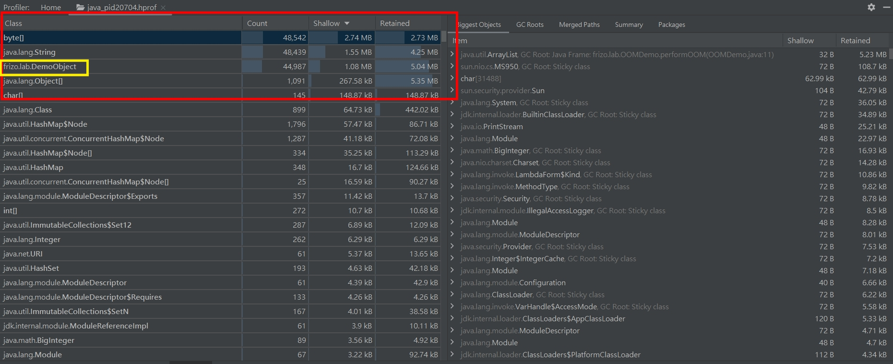
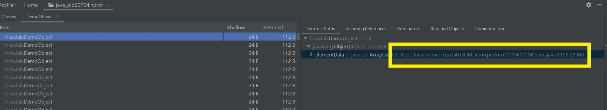
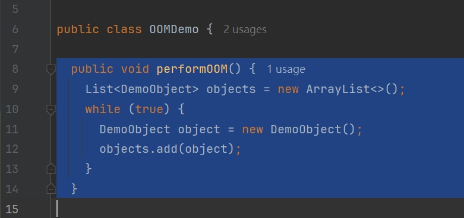

# JVM 優化系列(四) 由 OOM ( out of memory )  引出的 JVM 排查與優化方法

<br>

---

<br>

__問 : 如果 Java 應用程式運行過程出現 OOM 該怎麼辦 ?__

<br>

面對這個問題，OOM 問題的導致原因要先歸類可能的幾個原因:

<br>


1. __應用一次申請太多物件__

    例如一次性向 DB 申請了千萬筆資料放到 List 中。對應解法就是不要這樣做，請改用分頁查詢。

    <br>

2. __使用不當建立物件__

    例如高併發情況下，頻繁建立 Thread 或頻繁建立 JDBC Connection，且未妥善處理釋放資源就會導致 OOM。對應方法就是改用 Pool 來管理 Thread 或 Connection。

    <br>

3. __JVM 本身分配的資源就不夠__

    使用 `jmap -heap` 查看 heap 的狀況。透過一系列 JVM 啟動參數優化來調整。


<br>
<br>
<br>
<br>

---

<br>

>本篇筆記使用 JDK 13 版本，需要搭配我寫的一個 JAR 檔做示範

>__Download JAR__: [demo-oom.jar](https://github.com/Johnny1110/Dev_Knowledge/raw/main/java/jvm/OOM/jar/demo-oom.jar)

>如果想跟著筆記操作，可以下載下來使用。

<br>

---

<br>
<br>

## 1, 2 類問題排查

<br>
<br>

先說一下針對 __應用一次申請太多物件__ 或 ___使用不當建立物件__ 類型問題處理方式。

首先這兩類問題是由程式碼設計不良造成的，所以要定位的點，當然就是到底是哪一行程式碼在搞事情。

要定位 OOM 問題點有要分不同情境:

* 情境 1. 系統已經 GG

* 情境 2. 系統還在運行，但是記憶體快撐爆，或者 CPU 占用過高。

<br>
<br>

## 情境 1. 系統已經 GG

<br>

在 JVM 啟動時，需要設定一個 dump 參數。

```bash
java -Xms1m -Xmx5m -XX:+HeapDumpOnOutOfMemoryError -XX:HeapDumpPath=./ -jar demo-oom.jar oom 
```
<br>

參數說明:

`-Xms1m`: 設定 Heap 最小 1MB。

`-Xmx5m`: 設定 Heap 最大 5MB (設定這麼小單純是要他爆)。

`-XX:+HeapDumpOnOutOfMemoryError`: 設定當 OOM 時，Dump Heap 資料。

`--XX:HeapDumpPath=./`: 設定當 Dump Heap 資料路徑。

`-jar demo-oom.jar`: 指定要執行的 jar 

`oom`: 我的程式碼客製化命令，`oom` 代表直接爆炸，`noom` 代表塞到快爆但是不要爆。

<br>

__如果上線運行的應用程式沒有設定 `HeapDumpOnOutOfMemoryError`，那直接就死無對證了。所以這個參數一定要加在生產環境的 jvm 啟動參數裡面。(磁碟空間體記得加大，不然可能容量不夠寫)__


<br>

執行結果:

```bash
> java -Xms1m -Xmx5m -XX:+HeapDumpOnOutOfMemoryError -XX:HeapDumpPath=./ -jar demo-oom.jar oom      

perform OOM...
java.lang.OutOfMemoryError: Java heap space
Dumping heap to ./\java_pid20704.hprof ...
Heap dump file created [9300671 bytes in 0.039 secs]
Exception in thread "main" java.lang.OutOfMemoryError: Java heap space
        at java.base/java.lang.Long.fastUUID(Long.java:436)
        at java.base/java.lang.System$2.fastUUID(System.java:2205)
        at java.base/java.util.UUID.toString(UUID.java:395)
        at frizo.lab.DemoObject.<init>(DemoObject.java:10)
        at frizo.lab.OOMDemo.performOOM(OOMDemo.java:11)
        at frizo.lab.Main.main(Main.java:10)

```
<br>

發生 OOM 後，找到 heap log 文件


<br>

要查看這個文件可以使用 idea 直接打開，或者使用 [VisualVM](https://visualvm.github.io/) 查看。

我使用 idea 示範。

<br>



<br>

可以看到 Retain 占比最高的幾個 Class，像是 Java 原生類別我們就先放過，因為不好排查，然後我們就可以鎖定一個可疑的類別 frizo.lab.DemoObject。

點進去一看究竟:

<br>



<br>

可以看到 CG Root 的引用指向 OOMDemo 類別的 performOOM() 方法第 11 行。那就來看看程式碼中的 11 行幹了甚麼。

<br>



<br>

原來是這裡寫了一個迴圈不停建立物件往 ArrayList 塞。以上問題排查結束。


<br>
<br>
<br>
<br>

## 情境 2. 系統還在運行，但是記憶體快撐爆，或者 CPU 占用過高。

<br>
<br>

這種情況可以使用 `jmap -dump` 取得當前直接階段的 heap 狀態，值得一提的是，使用這個指令會造成服務停頓，heap 越大停頓越久，在生產環境要慎用。

<br>

先啟動 jar 檔案。

```bash
java -Xms1m -Xmx20m -XX:+HeapDumpOnOutOfMemoryError -XX:HeapDumpPath=./ -jar demo-oom.jar noom
```

<br>

dump 資料出來。

<br>


```bash
> jps

14704 demo-oom.jar
17904 RemoteMavenServer36
15044 Jps
1512 

> jmap -dump:format=b,file=heap.hprof 14704

Heap dump file created

```


<br>
<br>
<br>
<br>

---

<br>
<br>

## 3 類問題排查

<br>


當我們確定程式碼沒問題，且已經沒有優化空間了。那就可以著手看看 JVM 優化了。

針對啟動要被排查的 Java 應用後，透過 `jps` 查詢應用 PID :

```bash
> jps
10088 shoppingCartBase-1.0-SNAPSHOT.jar
17420 Jps
```

<br>

我使用的是 jdk 13，其提供的 jmap 需樣像下面這樣使用

```bash
jhsdb jmap --heap --pid 10088
```

<br>

之後的排查操作就跟上面一樣了。

<br>

可以看到 console 結果:

```bash
>jhsdb jmap --heap --pid 10088

Attaching to process ID 10088, please wait...
Debugger attached successfully.
Server compiler detected.
JVM version is 13.0.1+9

using thread-local object allocation.
Garbage-First (G1) GC with 8 thread(s)

Heap Configuration: # 堆配置
   MinHeapFreeRatio         = 40 # 最小堆空閒比率
   MaxHeapFreeRatio         = 70 # 最大堆空閒比率
   MaxHeapSize              = 5337251840 (5090.0MB) # 堆最大容量
   NewSize                  = 1363144 (1.2999954223632812MB) # 新生代大小
   MaxNewSize               = 3202351104 (3054.0MB) # 新生代最大容量
   OldSize                  = 5452592 (5.1999969482421875MB) # 老年代大小
   NewRatio                 = 2 # 新生代與老年代的大小比率
   SurvivorRatio            = 8 # Survivor 空間與 Eden 空間的大小比率
   MetaspaceSize            = 21807104 (20.796875MB) # 元空間大小
   CompressedClassSpaceSize = 1073741824 (1024.0MB) # 壓縮類空間大小
   MaxMetaspaceSize         = 17592186044415 MB # 元空間最大容量
   G1HeapRegionSize         = 1048576 (1.0MB) # G1 Heap Region 大小

Heap Usage: # 堆使用情況
G1 Heap:
   regions  = 5090 # G1 堆區域數量
   capacity = 5337251840 (5090.0MB) # G1 堆總容量
   used     = 51934624 (49.528717041015625MB) # G1 堆已使用容量
   free     = 5285317216 (5040.471282958984MB) # G1 堆空閒容量
   0.9730592738902873% used # G1 堆已使用比例
G1 Young Generation:
Eden Space:
   regions  = 24 # Eden 空間區域數量
   capacity = 56623104 (54.0MB) # Eden 空間總容量
   used     = 25165824 (24.0MB) # Eden 空間已使用容量
   free     = 31457280 (30.0MB) # Eden 空間空閒容量
   44.44444444444444% used # Eden 空間已使用比例
Survivor Space:
   regions  = 11 # Survivor 空間區域數量
   capacity = 12582912 (12.0MB) # Survivor 空間總容量
   used     = 12265376 (11.697174072265625MB) # Survivor 空間已使用容量
   free     = 317536 (0.302825927734375MB) # Survivor 空間空閒容量
   97.47645060221355% used # Survivor 空間已使用比例
G1 Old Generation:
   regions  = 16 # 老年代區域數量
   capacity = 39845888 (38.0MB) # 老年代總容量
   used     = 14503424 (13.83154296875MB) # 老年代已使用容量
   free     = 25342464 (24.16845703125MB) # 老年代空閒容量
   36.39879728618421% used # 老年代已使用比例
```

其中詳細資料已經都列出註解說明其意義了，如果有看前面講到 [JVM 優化系列(二) 運行時內存 (新生代，老年代，永久代)](https://github.com/Johnny1110/Dev_Knowledge/blob/main/java/jvm/runtime/REAMDE.md) 應該或多或少都看得懂。

<br>

一般來說，像是 heap 內的容量比例分配，大小這種設定沒那個必要真的不太需要調整，新生代容量不足或物件大小超過設定值就會把物件移到老年代，老年代如果容量不足就會發生 OOM，__如過在總容量不變的條件下去配置新生代，老年代，永久代的大小比例。那就要真的很嚴肅的分析跟實驗__。其次還有 CG 方案可選擇。那就有太多可以調的地方了。

基本上針對 JVM 的內存，我們一般大眾沒有特別需求的情況下，就把 Heap 開大就行了。

<br>

```
java -Xms1024m -Xmx2048m ...
```

<br>
<br>
<br>
<br>

以下列出一些 JVM 優化參數 參考文章: https://juejin.cn/post/7283766466084290596?from=search-suggest

<br>

```bash
# 內存參數
-Xms：初始堆大小
-Xmx：最大堆疊大小
-Xmn：新生代大小
-Xss：執行緒堆疊大小，預設為1M
-XX:MaxPermSize=n:設定持久代大小
-XX:NewRatio：新生代與老年代的比例
-XX:SurvivorRatio：Eden區和Survivor區的比例

# GC 參數
-XX:+UseSerialGC：使用 Serial 垃圾回收器
-XX:+UseParallelGC：使用 Parallel 垃圾回收器
-XX:+UseConcMarkSweepGC：使用 CMS 垃圾回收器
-XX:+UseG1GC：使用 G1 垃圾回收器
-XX:MaxGCPauseMillis：最大GC停頓時間
-XX:+UseAdaptiveSizePolicy：自適應 GC 策略

# 列印
-XX:+PrintGCTimeStamps：列印 GC 停頓耗時
-XX:+PrintGCApplicationStoppedTime：列印垃圾回收期間程式暫停的時間.
-XX:+PrintHeapAtGC：列印 GC 前後的詳細堆疊訊息
-Xloggc:filename：把相關日誌資訊記錄到檔案以便分析.

# Thread 
-Xss：每个线程的堆栈大小
-XX:ParallelThreads：并行处理的线程数
-XX:+UseThreadPriorities：启用线程优先级
-XX:+UseCondCardMark：使用条件卡片标记

# 類別載入優化
-XX:MaxPermSize：最大方法區大小
-XX:+CMSClassUnloadingEnabled：啟用 CMS 類別卸載
-XX:+UseCompressedOops：使用壓縮物件指針

# 其他
-XX:+UseBiasedLocking：啟用偏向鎖
-XX:+OptimizeStringConcat：啟用字串拼接最佳化
-XX:MaxTenuringThreshold：物件晉升老年代的年齡閾值(多老算老)
-XX:CompileThreshold：JIT 編譯閾值
-XX:+PrintGCDetails：列印 GC 詳細資訊
```

<br>


