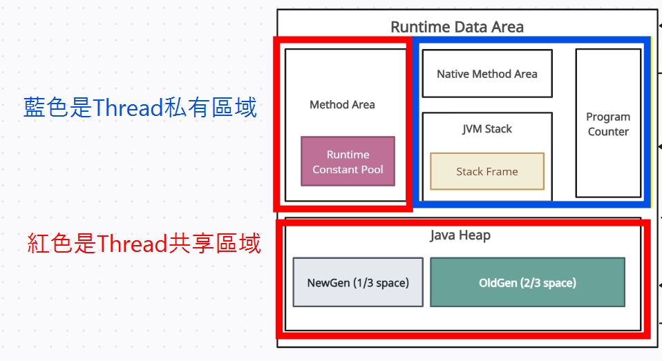

# JVM 優化系列(一) 內存區域介紹

 

---

 

JVM 都是由哪些部分組成 ? 他們都各自負責怎樣的工作 ?

用了 JVM 工作那麼久但是對他內部構造以及功能好像我都不太了解。透過這次筆記研究，就一次把 __JVM 構造__ 以及最重要的 __內存區域__ 一次搞懂。

 
 

## 什麼是 JVM ?

 

JVM 是用來運行 Java 的 .class 文件的虛擬機。

我們編寫得 .java 文件通過編譯器編譯完成後，會變成 .class 文件，然後 .class 文件會被 JVM 解釋器 (Interpreter) 編譯成機器碼在不同的 OS ( Windows/ Unix ) 上執行。每種 OS 的解釋器實現都不同，所以 Java 可以跨平台使用。

當一個 Java 進程 ( Process ) 開始運行時，JVM 就開始實例化，不同進程會實例化不同的 JVM，它們彼此是隔離的，不會共享內存。

當進程結束時，則 JVM 實例消亡。

 

總結 Java 程式執行步驟:

1. .java 文件編譯成 .class 文件。
2. 解釋器將 .class 文件編譯成 OS 的機器碼。
3. 機器碼調用 OS 的本地方法庫來操作系統進行工作。

 
 
 
 

## JVM 構造

 

JVM 構造如下圖所示

 

下面一一解釋他們各自的功用 : 

 
 

## Class Loader SubSystem

 

用於將編譯好的 .class 文件載入到 JVM 中。

 
 
 
 

## Runtime Data Area

 

用於儲存 JVM 運行過程中產生的資料。其中又可以按照 __Thread 私有區__ 與 __Thread 共享區__ 分成兩大類 :

    
 

Thread 私有區的生命週期與 Thread 相同，Thread 啟動時就一起建立，Thread 結束就銷毀。

Thread 共享區隨 JVM 啟動而建立，隨 JVM 關閉而銷毀。

 
 
    
### Thread 私有區 :

 

* Program Counter (程式計數器)

    程式計數器是一塊小空間，__用於存放當前執行的 Thread 所執行的程式碼行數指示器__ ( 更準確來說是指令位址，如果該方法是 Native 方法則程式計數器的值為 Undefined )。每個不同的 Thread 都有一個獨立的程式計數器。

    程式計數器是 Thread 私有的內存區域，他是唯一不會有 OOM 問題的區域。

 

* JVM Stack (虛擬機棧)

    JVM Stack 是描述 Java 方法執行過程的內存模型。他在 __Stack Frame 中儲存了局部變數表，操作數棧，動態鏈接，方法出口等訊息__。同時 Stack Frame 用來儲存部分運行時資料以及其資料結構。

    __Stack Frame 用來記錄方法執行過程，Thread 要執行方法時，JVM 會建立一個與該方法對應的 Stack Frame。無論方法是正常執行完還是噴錯，都視為方法執行完成。__

 

* Native Method Area (原生方法區)

    Native Method Area 跟 JVM Stack 類似，區別是 JVM Stack 為 Thread 執行的 Java 方法服務，__Native Method Area 是為 Thread 執行的原生方法服務。__

 
 

### Thread 共享區 :

 

* Java Heap (堆)

    在 JVM 執行過程中建立的物件和資料都被存放到 Java Heap 中。Heap 是 Thread 共享的，所以也就有了 Thread Safe 議題。

    __Java Heap 是 GC 回收垃圾的主要內存區域。這個區域可以說是對 JVM 學習與優化上最重要的位置，後兩個章節會獨立來談 Heap 與 GC。__

 

* Method Area (方法區)

    方法區也被稱為 __永久代 (在 Java 1.8 之前，1.8 開始永久代就變成 Metaspace 了)__。用於存放常數，靜態變數，類別信息，JIT (既時編譯器) 編譯後的機器碼，運行時常數池等資料。

    永久代的內存回收主要針對 Runtime Constant Pool (運行時常數池)，因此基本上回收不了什麼，因此叫做永久代。

    __.class 的內容將在被 Class Loader SubSystem 載入完成後保存到方法區的 Runtime Constant Pool。__

 
 
 
 

## Execution Engine (執行引擎)

 

執行引擎（Execution Engine）負責執行 .class 文件內容。

其中可分為 2 個單元:

 

### 1. JIT Complier (即時編譯器)

Just-In-Time (JIT) 在 __執行時期將 .class 文件內容編譯為原生機器碼來改善 Java 應用程式的效能__ (編譯成 OS 原生，執行速度更快)。

 

### 2. Garbage Collcection (GC/垃圾回收器)

__CG 是用來回收 Java Heap 內沒有被使用的物件。__ GC 是一個很重要的單位，後面會單獨用一個章節細講一下 GC 相關議題。

 
 
 
 

## Java Native Interface (JNI/本地介面)

JNI （Java Native Interface，Java 本地介面）是一種編程框架，使 JVM 中的 Java 程式可以呼叫本地方法庫，也可以被其他程式呼叫。

 
 
 
 

## Native Method Libraries (本地方法庫)

本地方法庫一般是用其它語言（C/C++ 或組合語言等）編寫的，並且被編譯為基於本機硬體和作業系統的程式。

 
 
 
 

---

 
 
 
 

## 補充: Direct Memory (直接內存)

 
上面提到的 Runtime Data Area 是 JVM 可以存取內存區域，除此之外還有一個 Direct Memory (DM/直接內存)。他並不是 Runtime Data Area 的一部分，但是也會被 JVM 頻繁使用。

JDK 的 NIO 提供的 Channel 與 Buffer 的 I/O 操作方法就是基於直接存取 Direct Memory 實現。

__NIO 透過調用 Native Lib 直接在 OS 上分配 Direct Memory，然後透過 DirectByteBuffer 作為 Reference 直接對其進行存取。這樣做的好處就是避免了 Java Heap 與 Native Heap 中來來回回複製資料所帶來的效能與資源浪費。因此 Direct Memory Access 技術在很多要求高併發的應用或框架中被廣泛使用 (ex: Netty，Hadoop)。__
