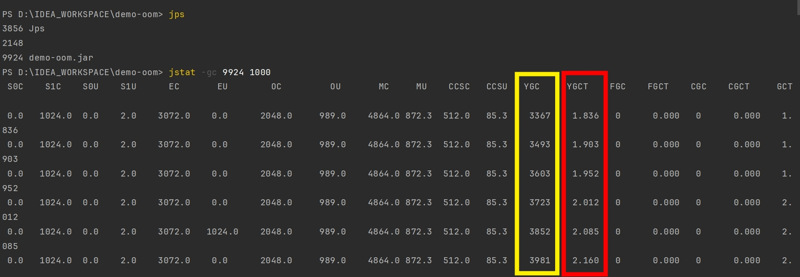

# JVM 優化系列(七) 檢查 Minor GC / Full GC 是否過於頻繁

<br>

---

<br>

本篇筆記別說明一下檢查與優化 Minor GC / Full GC 的方法。

<br>

----

<br>

## 檢查與優化 Minor GC

<br>

### 檢查 Minor GC:


使用 `jstat -gc <PID> <msec>` 可以對應用進行 GC 檢查 (msec 是指多少毫秒更新一次資料)。

<br>



<br>

可以看到報表中的兩個重要指標 __YGC (Minor GC 總次數)__，__YGCT (Minor GC 總耗時)__。

以上可以看到該應用的 Minor GC 發生的較為頻繁。當 Minor GC 發生頻繁，但是並沒有 OOM 發生，就代表物件流入到老年代後，可以被 Full GC 清理掉。

假定程式碼沒有問題的前提下，能做的就是針對新生代空間或整體 Heap 空間進行優化。

<br>
<br>

### 優化 Minor GC 過於頻繁:

通常由於新生代空間太小，導致 Eden 區很快被填滿，從而導致頻繁 Minor GC。我們可以透過調整新生代空間 `-Xmn` 來做優化。

```
java -Xms1024m -Xmx2048m -Xmn1024m -XX:+HeapDumpOnOutOfMemoryError -XX:HeapDumpPath=./ -jar demo-oom.jar mgc
```

上述 JVM 啟動選項中，我把 Heap 整體空間開大，並給了新生代 1024(整體一半) 的空間。

<br>

在來看一下優化成果:


<br>

可以看到前後兩次對比，效果明顯，優化前一秒 YGC 好多次，優化後頻率相對低很多了。

<br>
<br>
<br>
<br>

---

<br>
<br>
<br>

## 檢查 Full GC

<br>

Full GC 如果頻繁發生的話，那就是比較嚴重的問題了 :


### 先了解從程式碼角度會有哪些情況導致 Full GC。

* 系統一次性載入過多資料(ex: SQL select all)，導致大物件被送入老年代。

* 頻繁建立了大量物件，且無法被回收(ex: 調用 IO 用完不 close 釋放)，導致 Full GC 瘋狂觸發也清理不掉，最後結果就是 OOM。

* 頻繁建立長生命週期物件，年齡超過 15 歲(預設經歷 Minor GC 15 次) 就會進入老年代。在老年代又繼續活著占空間。最終也會導致瘋狂 Full GC，最終 OOM。

* JVM Heap 空間參數設定太小。


<br>
<br>

檢查 Full GC 方法跟 Minor GC 一樣使用 `jstat -gc`，只差在關注的參數不一樣 :

<br>


這次關注的參數有 4 個分別是:

<br>

__OC__：老年代的容量 (kb)

__OU__：老年代目前已使用空間 (kb)

__FGC__：總 Full GC 次數

__FGCT__：總 Full GC 所用時間(s)

<br>
<br>

要排查 Full GC 導致原因可以有以下幾種作法:


<br>

1. 查看 Heap 個分區使用率以及 GC 情況。

    ```bash
    jstat -gcutil -h20 <PID>
    ```


2. 查看 Heap 中存活的物件，並按大小排序。

    ```bash
    jmap -histo <PID>
    ```

3. dump 出 Heap 文件，用可視化工具檢查。

    ```bash
    jmap -dump:format=b,file=heap.hprof <PID>
    ```


<br>
<br>
<br>
<br>


---

<br>

`jstat -gc` 報表參數意義對應表:


```
S0C：年輕代中第一個survivor（倖存區）的容量 (kb)
S1C：年輕代中第二個survivor（倖存區）的容量 (kb)
S0U：年輕代中第一個survivor（倖存區）目前已使用空間 (kb)
S1U：年輕代中第二個survivor（倖存區）目前已使用空間 (kb)
EC：年輕代中Eden（伊甸園）的容量 (kb)
EU：年輕代中Eden（伊甸園）目前已使用空間 (kb)
OC：Old代的容量 (kb)
OU：Old代目前已使用空間 (kb)
PC：Perm(持久代)的容量 (kb)
PU：Perm(持久代)目前已使用空間 (kb)
YGC：從應用程式啟動到採樣時年輕代中gc次數
YGCT：從應用程式啟動到採樣時年輕代中gc所用時間(s)
FGC：從應用程式啟動到採樣時old代(全gc)gc次數
FGCT：從應用程式啟動到採樣時old代(全gc)gc所用時間(s)
GCT：從應用程式啟動到採樣時gc用的總時間(s)
NGCMN：年輕代(young)中初始化(最小)的大小 (kb)
NGCMX：年輕代(young)的最大容量 (kb)
NGC：年輕代(young)中目前的容量 (kb)
OGCMN：old代中初始化(最小)的大小 (kb)
OGCMX：old代的最大容量 (kb)
OGC：old代目前新產生的容量 (kb)
PGCMN：perm代中初始化(最小)的大小 (kb)
PGCMX：perm代的最大容量 (kb)
PGC：perm代目前新產生的容量 (kb)
S0：年輕代中第一個survivor（倖存區）已使用的佔目前容量百分比
S1：年輕代中第二個survivor（倖存區）已使用的佔目前容量百分比
E：年輕代中Eden（伊甸園）已使用的佔目前容量百分比
O：old代已使用的佔當前容量百分比
P (jdk 1.7)：perm代已使用的佔當前容量百分比
M (jdk 1.8 +)：perm代已使用的佔當前容量百分比
S0CMX：年輕代中第一個survivor（倖存區）的最大容量 (kb)
S1CMX ：年輕代中第二個survivor（倖存區）的最大容量 (kb)
ECMX：年輕代中Eden（伊甸園）的最大容量 (kb)
DSS：目前需要survivor（倖存區）的容量 (kb)（Eden區已滿）
TT： 持有次數限制
MTT ： 最大持有次數限制
```

<br>

參考資料:

https://blog.csdn.net/yuxin6866/article/details/77718748
https://blog.csdn.net/wangxuelei036/article/details/108180150
https://www.bilibili.com/video/BV1iC4y1F71Q/?vd_source=9780a181ac9f1fee5f680f255ee5bc73

